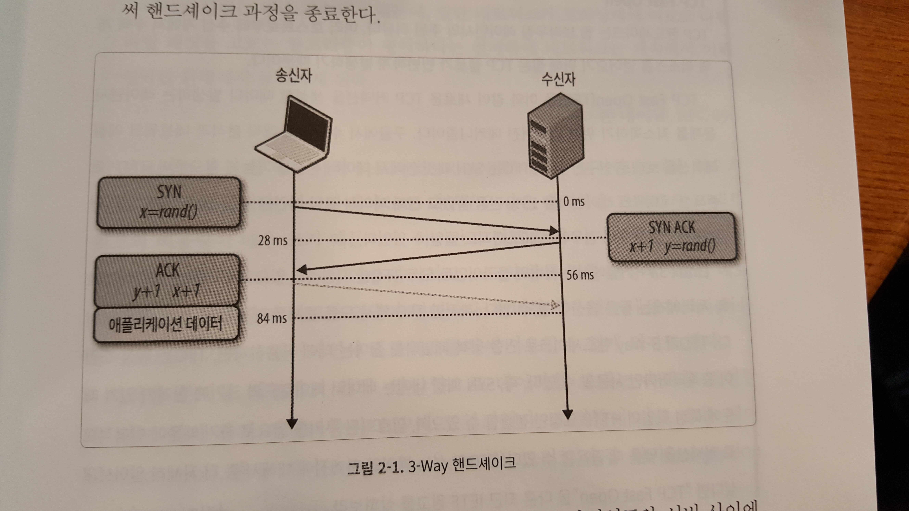
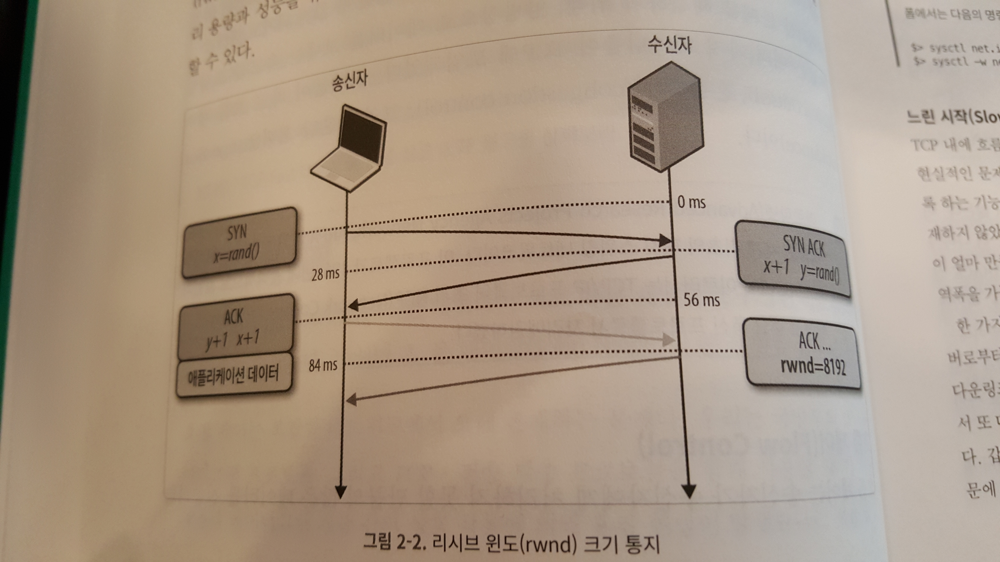

# 들어가며
이 포스팅은 <<구글 엔지니어에게 듣는 네트워킹과 웹 성능 최적화 기법>>의 2장, TCP의 구성요소를 요약한 것입니다.

# TCP의 구성 요소
인터넷의 중심에는 두 개의 프로토콜, IP와 TCP가 존재한다. IP는 호스트에서 호스트로의 라우팅과 주소 할당 기능을 제공하고, TCP는 신뢰성을 보장해주느 ㄴ네트워크 기능을 제공한다. TCP는 기존의 프로토콜들을 신속하게 대처하였으며, 현재 많은 애플리케이션에서 사용하고 있다.

TCP는 신뢰할 수 없는 채널 위에 신뢰성을 구축한 추상 계층이다. 이는 유실 데이터 재전송, 전송 순서 확인, 혼잡 제어 및 회피 데이터 무결성 확인 같은 복잡한 기능을 투명하게 처리하여, 애플리케이션의 구현을 한결 쉽게 만들어 준다. TCP 스트림의 특징 중 하나가, 전송된 모든 바이트는 수신된 모든 바이트와 한치의 오차 없이 동일하며, 클라이언트에서 전송한 바이트 순서대로 도착한다는 것이다.

이러한 점 때문에 TCP는 성능에 안 좋은 영향을 미치기도 한다. 그러나 실제로 오늘날 HTTP 트래픽은 모두 TCP를 통해 전송되고 있다. TCP 자체적으로 훌륭한 기능들을 갖추고 있기 때문이다.

## 3-Way 핸드셰이크
모든 TCP 연결은 3-Way 핸드셰이크부터 시작된다. 클라이언트와 서버가 애플리케이션 데이터를 주고받으려면, 먼저 시작 패킷의 시퀀스 번호와 현재 연결과 관련된 여러 변수의 값을 상호 합의해야 한다. 순서 번호는 보안상의 이유로 양쪽에서 무작위로 뽑는다.

3-Way 핸드셰이크가 끝나면, 애플리케이션 데이터가 클라이언트 - 서버 사이를 오고 갈 수 있게 된다. 클라이언트는 ACK 패킷 뒤에 바로 데이터 패킷을 보낼 수 있고, 서버는 ACK 패킷이 도착한 뒤에 데이터 패킷을 보낼 수 있다. 새로 맺어지는 모든 커넥션은 데이터가 전송되기 전에 왕복 레이턴시를 한번 겪게 된다.

만약 클라이언트가 뉴욕에 있고, 서버가 런던에 있다고 가정하자. 광섬유 링크에서 새로운 TCP 커넥션을 맺게 되면, 3-Way 핸드셰이크에 최고 56밀리초가 소요된다. 이 과정에서 대역폭의 크기는 소요 시간에 어떠한 영향도 미치지 않는다. 

3-Way 핸드셰이크로 인해 발생하는 지연이 크기 때문에, 새로운 TCP 커넥션을 맺는 것보다 기존에 연결되어 있는 TCP 커넥션을 재사용하는 것이 애플리케이션 최적화에 아주 중요한 역할을 한다.

## 혼잡 제어 및 회피
혼잡 제어는 혼잡 붕괴 현상을 피하기 위해 만들어 진 메커니즘이다. 혼잡 붕괴 현상이라 함은 다음과 같다 :

TCP에서는 데이터를 전송한 후에, ACK가 클라이언트로부터 오지 않으면 서버측에서는 패킷이 가지 않았다고 생각하고 다시 데이터를 전송한다. 그러나 클라이언트로 가는 네트워크에 패킷이 넘쳐서, 중간 라우팅 노드의 큐가 다 차버렸다고 가정하자.

서버는 클라이언트로 패킷을 보낸다. ACK가 오지 않는다 (큐가 다 차버렸으므로). 다시 서버는 패킷을 보낸다 > ACK가 오지 않는다.

이 과정이 연속적으로 발생하면서, 스위칭 노드에 있는 모든 큐가 차버리고, 패킷은 버려지게 된다. 호스트는 같은 패킷을 여러 번 보내게 되고 같은 패킷의 복사본이 목적지에 도달하게 된다. 이를 혼잡 붕괴라고 한다.

이를 막기 위해 양방향으로 데이터를 전송하는 속도를 조절할 수 있는 여러 메커니즘이 TCP에 도입되었다. 그것들이 바로 흐름 제어, 혼잡 제어, 그리고 혼잡 회피이다.

### 흐름 제어
흐름 제어는 송신자가 수신자에게 처리할 수 없을 만큼 많은 데이터를 보내는 것을 미리 방지하는 메커니즘이다. 수신자가 데이터를 받지 못한다는 것은, 보통 다른 데이터를 처리하고 있거나, 밀려있는 데이터가 많거나, 버퍼 공간을 충분히 지정해 주지 않기 때문이다. 

이러한 문제를 해결하기 위해, 양쪽의 TCP 커넥션이 각각 자신의 리시브 윈도(rwnd)를 통지하여, 수신 데이터를 저장할 버퍼 공간의 크기를 서로에게 알려준다.

1. 일단 커넥션이 이루어지면, 양쪽에서 자신들의 시스템 기본 설정값을 이용하여 rwnd값을 초기화한다. 
2. 어떠한 이유로든 서버/클라이언트 중 어느 한 곳에서 수신하고 잇는 데이터의 양을 감당하지 못할 경우에는, 송신자에게 리시브 윈도의 크기를 예전보다 줄여 재통지한다.
3. 윈도의 크기가 0에 다다르면, 현재 버퍼에 남아있는 데이터가 모두 애플리케이션 계층에서 처리될 때까지 새로운 데이터를 수신할 수 없다고 표시된다.

이런 일련의 흐름은 모든 TCP 커넥션이 시작될 때부터 끝날 때까지 계속된다. 모든 ACK 패킷은 양 끝단의 가장 최근 윈도 크기를 담고 있다. 이 끝의 노드는 이 값을 참고하여 송신자와 수신자의 처리 용량과 성능을 유추해내고, 이를 고려하여 전송할 데이터 양을 유동적으로 조절할 수 있다.

### 느린 시작
흐름 제어는 송신자가 수신자에게 부담을 주지 않도록 하는 기능을 하고 있었으나, 네트워크 자체에 주는 부담을 막는 메커니즘은 존재하지 않았다. 송신자나 수신자 모두 새로운 커넥션이 생성될 때, 허용된 대역폭이 얼마 만큼인지 알지 못하기 때문에 수시로 변화하는 네트워크 상태에 따라 대역폭을 가늠하고, 그에 따라 데이터의 전송속도를 조절하는 메커니즘이 필요했다.

예를 들면, 내가 비디오 스트리밍을 하고 있는데 추가적으로 토렌트에서 데이터를 받기 시작했다. 이 경우 비디오 스트리밍의 패킷을 조정하지 않는다면, 데이터는 중간에 있는 게이트웨이에서 점점 쌓이게 되고, 패킷이 누락되게 되면서 네트워크를 효율적으로 사용할 수 없게 된다.

이를 대비하기 위해, 느린 시작 / 혼잡 회피 / 빠른 재전송 / 빠른 복구 알고리즘이 TCP에 도입되었다. 이 네 가지 알고리즘은 신속하게 TCP스펙의 필수저긴 부분으로 자리 잡았다.

느린 시작 알고리즘은 다음과 같은 순서로 동작한다.

1. 서버는 각 TCP 커넥션마다 새로운 혼잡 윈도 크기(cwnd) 변수를 만들고, 그 값을 시스템에 정해진 안전한 수치로 설정한다. cwnd변수는 송신자와 수신자 사이에서 서로 교환되지 않고, 서버의 private 값으로 관리된다.
2. 송신자와 수신자 사이에서 이동중인, ACK를 받지 않는 데이터의 최대치는 rwnd와 cwnd값 중 작은 값이 된다.

그러면 어떻게 cwnd의 최적값을 알아낼 수 있을까? 문제의 해결법은 커넥션의 초반에는 천천히 시작하여, ACK를 받으면서 점점 윈도 사이즈를 늘려 가는 것이다.

본래 cwnd의 초기값은 1 네트워크 세그먼트로 정해져 있었다. 1999년 4월에 이 값을 4 세그먼트로 늘렸고, 2013년 4월에 10세그먼트로 다시금 값을 증가시켰다.

새 TCP 커넥션에서 이동 중인 데이터의 최대치는 rwnd와 cwnd의 최소값으로 정해져 있다. 그러므로 서버는 클라이언트에게 최대 4 네트워크 세그먼트를 한번에 보낼 수 있고 그 후에 ACK 신호를 기다려야 한다.

그리고 나서는 ACK 신호를 받을 때마다, cwnd의 윈도 사이즈를 1 세그먼트만큼 증가시킨다. ACK를 받은 패킷 하나당, 두 개의 새로운 패킷을 더 보낼 수 있는 것이다.

이렇게 하면 cwnd크기는 기하급수적으로 상승하게 된다. 

이 알고리즘이 적용되기 때문에, TCP상에서 동작하는 HTTP나 다른 모든 애플리케이션 프로토콜들은 주어진 대역폭과 관계없이 무조건 이 느린 시작 단계를 거쳐야 한다. 모든 TCP 커넥션에서, 우리는 곧바로 링크의 최대 허용량을 활용할 수 없다. 대신에 데이터가 왕복할 때마다 윈도 사이즈를 두 배씩 늘려 가는 것이다.

느린 시작은 대옹량 데이터를 스트리밍하는 데에는 거의 영향을 미치지 않는다. 그러나, 연결이 짧고 일시적인 경우에는 최대 윈도 크기에 도달하기 전에 요청이 끝나버리는 일이 발생한다. 느린 시작은 용량이 작은 데이터를 전송하는 데에는 부작용으로 다가온다.

### 혼잡 회피
